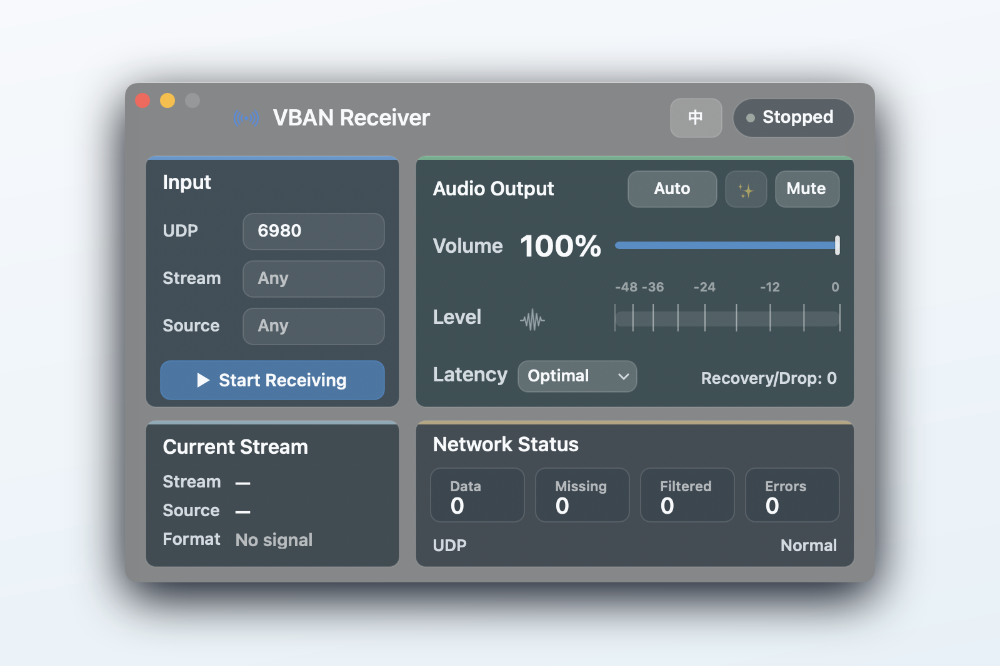
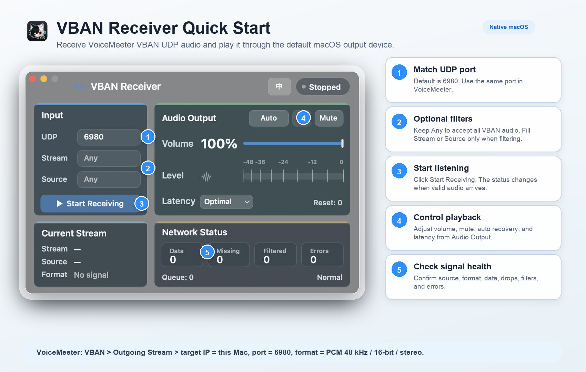

# VBAN Receiver for macOS

<p align="center">
  
</p>

<p align="center">
  <strong>A small native macOS receiver for VoiceMeeter VBAN audio streams.</strong><br>
  Receive VBAN UDP audio on your Mac and play it through the default macOS output device.
</p>

<p align="center">
  <a href="README.zh-CN.md">中文说明</a>
  ·
  <a href="docs/wiki.en.md">Detailed Wiki</a>
</p>

<p align="center">
  
  
  
  
</p>



## Highlights

- Native AppKit interface with Chinese and English UI.
- Receives VBAN AUDIO packets over UDP.
- Plays PCM streams through the default macOS output device.
- Optional filtering by stream name and sender host.
- Volume, mute, automatic output recovery, and latency controls.
- Network counters for received data, missing packets, filtered packets, errors, and queue depth.

## Quick Start

Requirements:

- macOS 13 or later.
- Xcode Command Line Tools.

Build and open the app from the repository root:

```bash
make test
make app
open "dist/VBAN Receiver.app"
```

For a command-line launch without the app bundle:

```bash
make build
./.build/VBANReceiver
```

## VoiceMeeter Setup

1. Open `VBAN` in VoiceMeeter.
2. Enable an outgoing stream.
3. Set the target IP to this Mac.
4. Use UDP port `6980` unless you changed it in the app.
5. Prefer PCM audio such as `48 kHz / 16-bit / stereo`.

## Usage Guide



1. Enter the UDP port. The default is `6980`.
2. Leave `Stream` empty to accept any VBAN stream, or enter a stream name to filter.
3. Leave `Source` empty to accept any sender, or enter a sender host/IP to filter.
4. Click `Start Receiving`.
5. Adjust volume, mute, recovery, and latency according to your network conditions.

## Supported Input

- VBAN AUDIO packets over UDP.
- PCM 8-bit, 16-bit, 24-bit, and 32-bit integer.
- PCM 32-bit float and 64-bit float.

Compressed VBAN codecs and serial/text subprotocols are intentionally ignored.

## Playback Options

The latency menu changes the playback buffering policy:

- `Low latency`: starts playback as soon as possible and keeps a short queue.
- `Balanced`: default setting for normal local-network use.
- `Stable`: keeps a deeper queue for unstable Wi-Fi or bursty senders.

## Packaging Note

`make app` creates a local app bundle in `dist/` and signs it ad hoc for local testing. Public distribution still needs Developer ID signing and notarization.

## Toolchain Note

This project is Objective-C/AppKit because the current Command Line Tools install on this Mac has a mismatched SwiftPM/SDK setup. It builds with `clang` and does not require full Xcode.
