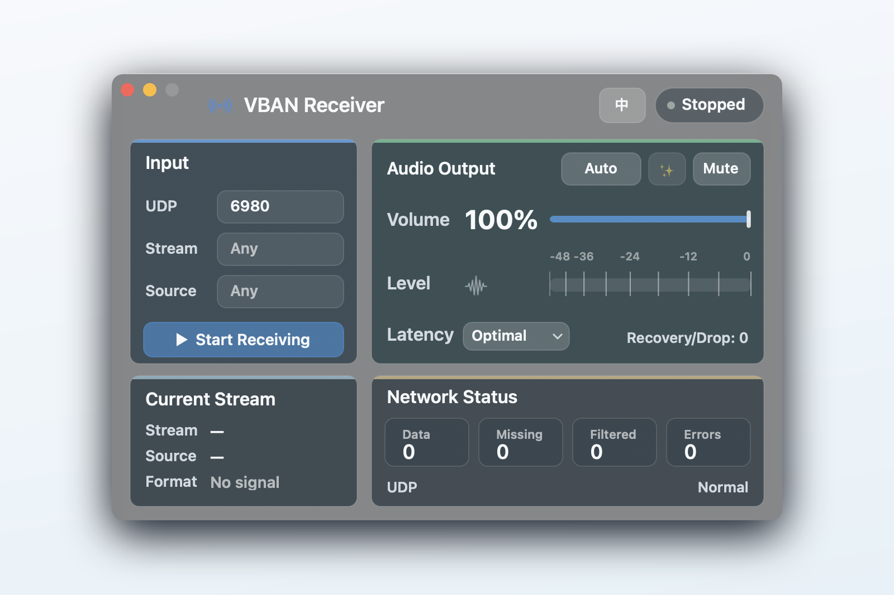
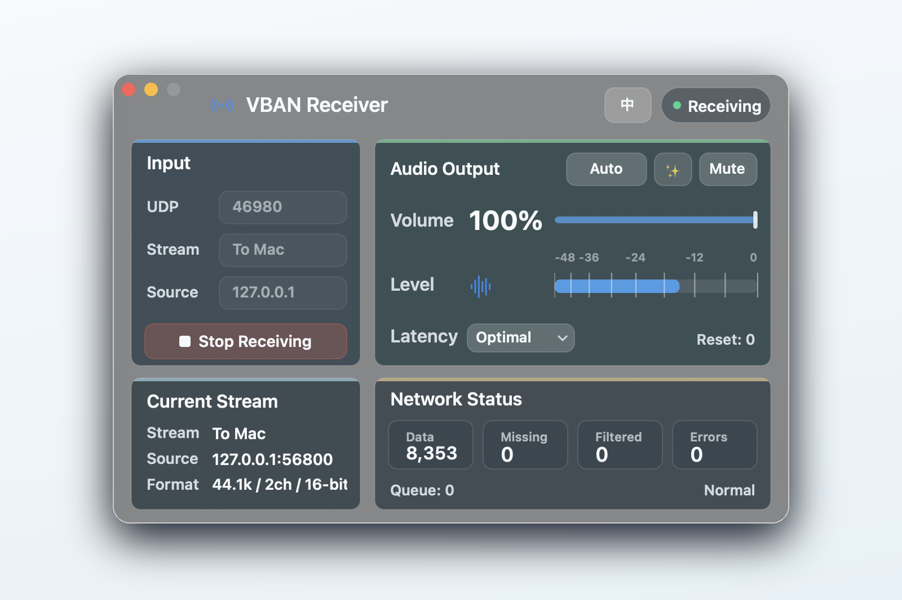
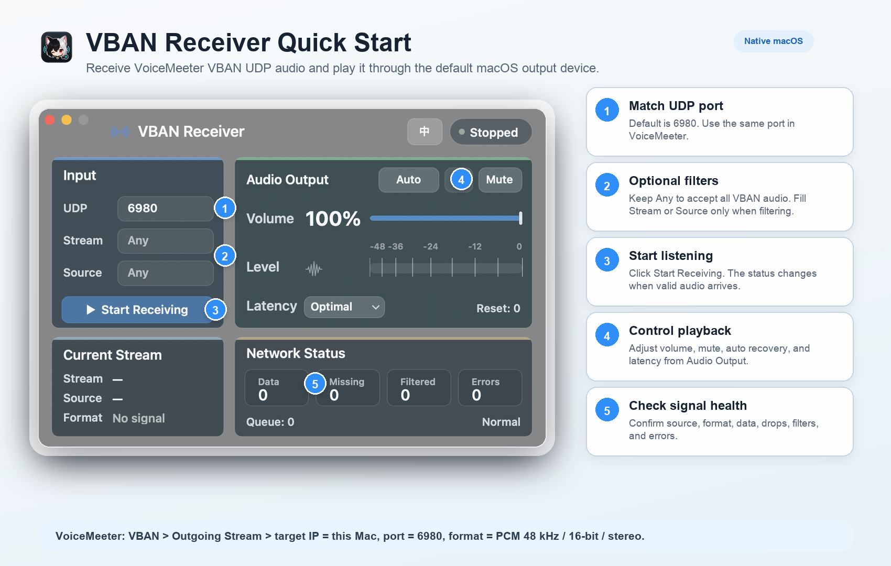

# VBAN Receiver for macOS

<p align="center">
  
</p>

<p align="center">
  <strong>A small native macOS receiver for VoiceMeeter VBAN audio streams.</strong><br>
  Receive VBAN UDP audio on your Mac and play it through the default macOS output device.
</p>

<p align="center">
  <a href="README.zh-CN.md">中文说明</a>
  ·
  <a href="docs/wiki.en.md">Detailed Wiki</a>
</p>

<p align="center">
  
  
  
  
  
  
</p>

## Download and Install

You need **macOS 13 or later and an Apple Silicon Mac**. You do not need Xcode to use the download. The release does not include an Intel `x86_64` slice.

1. Open the [v0.3.14 release page](https://github.com/XiaoLeXLDW/vban-receiver-mac/releases/tag/v0.3.14) and download `VBAN-Receiver-v0.3.14-build18-arm64-macos.zip`, rather than GitHub's automatically generated Source code archive.
2. Extract the ZIP and drag `VBAN Receiver.app` into Applications.
3. Open the app. This community download is **ad-hoc signed, without Developer ID signing or notarization**. If macOS blocks it, verify the download source before following the app-specific prompts in System Settings → Privacy & Security.
4. Configure VoiceMeeter below, then click `Start Receiving`.

For developer verification prompts, see [Apple’s instructions for opening an app from an unknown developer](https://support.apple.com/en-ca/guide/mac-help/mh40616/mac).

**Version scope:** the download is the published v0.3.14 release. Source changes after that tag are not included in the release asset.



## Receiving State



The screenshot uses a local loopback test stream and a temporary port. For normal use, send to the Mac’s LAN IP and match the port on both sides (default `6980`).

## Highlights

- Native AppKit interface with Chinese and English UI.
- Apple Silicon build for `arm64` / `aarch64` Macs.
- Receives VBAN AUDIO packets over UDP.
- Plays PCM streams through the default macOS output device.
- Optional filtering by stream name and sender host.
- Volume, mute, automatic output recovery, and latency controls.
- Network counters for received data, missing packets, filtered packets, errors, and audio recovery/drop events.

## VoiceMeeter Setup

1. Open `VBAN` in VoiceMeeter.
2. Enable an outgoing stream.
3. Set the target IP to this Mac.
4. Use UDP port `6980` unless you changed it in the app.
5. Prefer PCM audio such as `48 kHz / 16-bit / stereo`.

## Usage Guide



1. Enter the UDP port. The default is `6980`.
2. Leave `Stream` empty to accept any VBAN stream, or enter a stream name to filter.
3. Leave `Source` empty to accept any sender, or enter a sender host/IP to filter.
4. Click `Start Receiving`.
5. Adjust volume, mute, recovery, and latency according to your network conditions.

## Supported Input

- VBAN AUDIO packets over UDP.
- PCM 8-bit, 16-bit, 24-bit, and 32-bit integer.
- PCM 32-bit float and 64-bit float.

Compressed VBAN codecs and serial/text subprotocols are rejected. If they pass the source filter, these packets increment Errors and are not played.

## Playback Options

The latency menu controls how much audio the receiver buffers before and during playback:

- `Optimal`: default setting for normal local-network use.
- `Fast`: shorter queue for lower latency on a stable network.
- `Medium`: more buffering for occasional jitter.
- `Slow`: deeper buffer for unstable Wi-Fi.
- `Very Slow`: maximum buffering for bursty or unreliable streams.

## Build from Source

Developers need Xcode Command Line Tools, including `clang` and the macOS SDK; the full Xcode app is not required. Clone the repository, then build from its root. If you already have a checkout, start with `cd` into that directory and skip the clone command. These commands build the current source; changes after v0.3.14 are not included in the download:

```bash
git clone https://github.com/XiaoLeXLDW/vban-receiver-mac.git
cd vban-receiver-mac
make build
make test
make app
make validate-app
```

Open `dist/VBAN Receiver.app` in Finder. `make app` creates an ad-hoc signed development bundle. Its About dialog and bundled `build-info.json` identify the source commit and whether local changes were included; `make validate-app` checks the existing bundle without rebuilding it. See the [release checklist](docs/releasing.md) for the full release process.

## Menu Bar and Troubleshooting

Closing the window or pressing `Command + W` hides it to the menu bar while reception and playback continue. Choose `Show Window` from the menu-bar icon to reopen it. Use `Quit VBAN Receiver` or `Command + Q` to exit completely.

VBAN does not authenticate senders. Use it on a trusted LAN and set `Source` when practical; the host name or IP is resolved once when reception starts. See the [English Wiki](docs/wiki.en.md) for keyboard behavior, counters, log privacy, and troubleshooting.

Find guides and development material in the [documentation index](docs/README.md).

## License

This project is licensed under the [MIT License](LICENSE).
