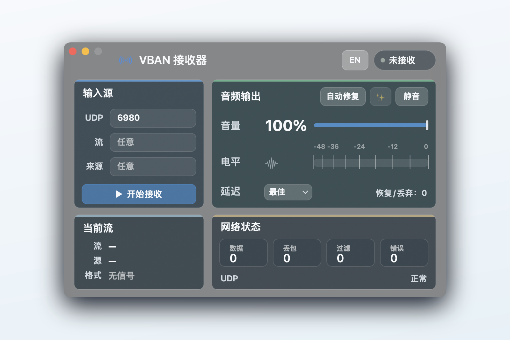

# VBAN Receiver for macOS

<p align="center">
  
</p>

<p align="center">
  <strong>一个原生 macOS VBAN 音频接收器。</strong><br>
  从 VoiceMeeter 接收 VBAN UDP 音频流，并通过 macOS 默认输出设备播放。
</p>

<p align="center">
  <a href="README.md">English README</a>
  ·
  <a href="docs/wiki.md">详细 Wiki</a>
  ·
  <a href="docs/wiki.en.md">English Wiki</a>
</p>

<p align="center">
  
  
  
  
  
</p>



## 主要功能

- 原生 AppKit 界面，支持中文和英文切换。
- 当前版本是 Apple Silicon `arm64` / `aarch64` 架构构建。
- 通过 UDP 接收 VBAN AUDIO 数据包。
- 将 PCM 音频播放到 macOS 默认输出设备。
- 可按流名和发送端主机过滤。
- 支持音量、静音、自动修复和延迟策略。
- 提供数据、丢包、过滤、错误和队列状态计数。

## 快速开始

要求：

- macOS 13 或更高版本。
- Apple Silicon Mac，例如 M1/M2/M3/M4。当前 release 不是 Universal binary，不包含 Intel `x86_64` 架构。
- Xcode Command Line Tools。

在仓库根目录构建并打开 app：

```bash
make test
make app
open "dist/VBAN Receiver.app"
```

不打包 app、直接运行命令行程序：

```bash
make build
./.build/VBANReceiver
```

## VoiceMeeter 设置

1. 在 VoiceMeeter 中打开 `VBAN`。
2. 启用一个 outgoing stream。
3. 目标 IP 填这台 Mac 的局域网 IP。
4. 端口使用 `6980`，除非你在 app 里改过。
5. 音频格式建议使用 PCM，例如 `48 kHz / 16-bit / stereo`。

## 使用说明


1. 填写 UDP 端口，默认是 `6980`。
2. `流` 留空表示接收任意 VBAN 流，也可以填写指定流名。
3. `来源` 留空表示接收任意发送端，也可以填写发送端主机名或 IP。
4. 点击 `开始接收`。
5. 根据网络情况调整音量、静音、自动修复和延迟策略。

## 支持的输入

- UDP 上的 VBAN AUDIO 数据包。
- PCM 8-bit、16-bit、24-bit、32-bit integer。
- PCM 32-bit float 和 64-bit float。

压缩 VBAN 编码、serial/text 等非音频子协议会被忽略。

## 播放选项

延迟菜单会改变播放缓冲策略：

- `低延迟`：尽快开始播放，保持较短队列。
- `均衡`：默认策略，适合普通局域网环境。
- `稳定`：队列更深，适合 Wi-Fi 不稳定或数据突发的环境。

## 打包说明

`make app` 会在 `dist/` 下生成 Apple Silicon `arm64` app bundle，并用 ad-hoc 签名用于本机测试。若要公开分发 `.app`，仍需要 Developer ID 签名和 notarization。

## 工具链说明

本项目使用 Objective-C/AppKit。原因是当前这台 Mac 的 Command Line Tools 存在 SwiftPM/SDK 版本不匹配问题；项目用 `clang` 构建，不依赖完整 Xcode。当前 release 二进制是非 Universal 的 `arm64` Mach-O，只面向 Apple Silicon。
