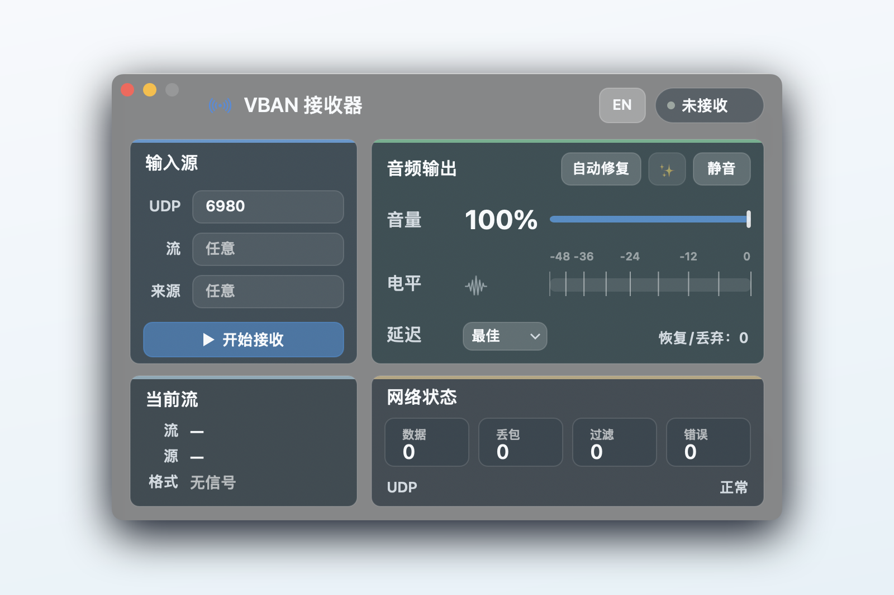
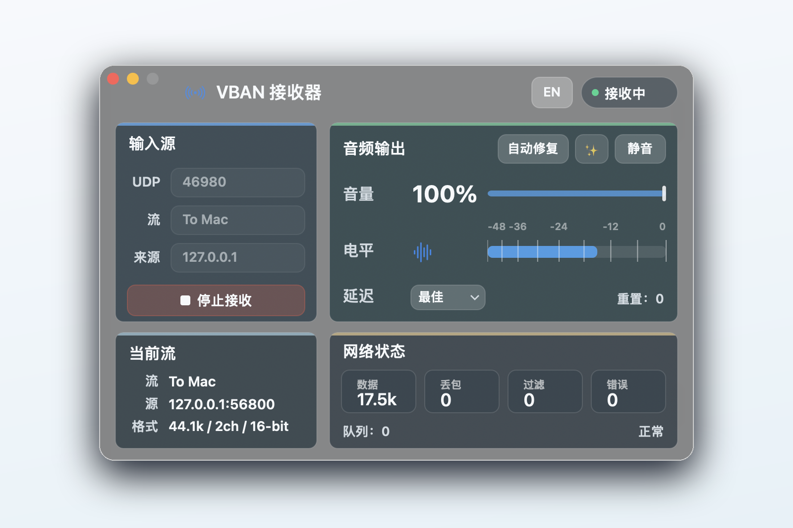
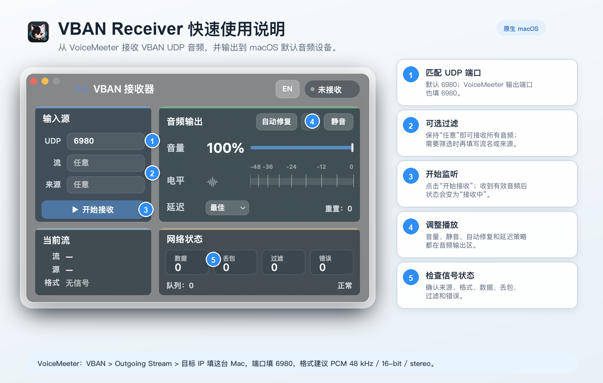

# VBAN Receiver for macOS

<p align="center">
  
</p>

<p align="center">
  <strong>一个原生 macOS VBAN 音频接收器。</strong><br>
  从 VoiceMeeter 接收 VBAN UDP 音频流，并通过 macOS 默认输出设备播放。
</p>

<p align="center">
  <a href="README.md">English README</a>
  ·
  <a href="docs/wiki.md">详细 Wiki</a>
  ·
  <a href="docs/wiki.en.md">English Wiki</a>
</p>

<p align="center">
  
  
  
  
  
  
</p>

## 下载并安装

需要 **macOS 13 或更高版本、Apple Silicon Mac**。下载使用不需要 Xcode；发布附件不包含 Intel `x86_64` 架构。

1. 打开 [v0.3.14 发布页](https://github.com/XiaoLeXLDW/vban-receiver-mac/releases/tag/v0.3.14)，下载 `VBAN-Receiver-v0.3.14-build18-arm64-macos.zip`，不要选择 GitHub 自动生成的 Source code 压缩包。
2. 解压后将 `VBAN Receiver.app` 拖入“应用程序”。
3. 打开 app。该社区附件使用 **ad-hoc 签名，尚未使用 Developer ID 签名或公证**。如果 macOS 阻止打开，请在确认下载来源后，按“系统设置 → 隐私与安全性”中的提示允许该 app 打开。
4. 按下面的 VoiceMeeter 设置发送音频，再点击“开始接收”。

遇到开发者验证提示时，请参阅 [Apple 官方打开说明](https://support.apple.com/en-ca/guide/mac-help/mh40616/mac)。

**版本范围：**下载入口对应已发布的 v0.3.14。该标签之后的源码改动不包含在此发布附件中。



## 接收中状态



截图使用本机回环测试流和临时端口；实际使用请填写 Mac 的局域网 IP，并让两端端口一致（默认 `6980`）。

## 主要功能

- 原生 AppKit 界面，支持中文和英文切换。
- 当前版本是 Apple Silicon `arm64` / `aarch64` 架构构建。
- 通过 UDP 接收 VBAN AUDIO 数据包。
- 将 PCM 音频播放到 macOS 默认输出设备。
- 可按流名和发送端主机过滤。
- 支持音量、静音、自动修复和延迟策略。
- 提供数据、丢包、过滤、错误，以及音频恢复/丢弃事件计数。

## VoiceMeeter 设置

1. 在 VoiceMeeter 中打开 `VBAN`。
2. 启用一个 outgoing stream。
3. 目标 IP 填这台 Mac 的局域网 IP。
4. 端口使用 `6980`，除非你在 app 里改过。
5. 音频格式建议使用 PCM，例如 `48 kHz / 16-bit / stereo`。

## 使用说明



1. 填写 UDP 端口，默认是 `6980`。
2. `流` 留空表示接收任意 VBAN 流，也可以填写指定流名。
3. `来源` 留空表示接收任意发送端，也可以填写发送端主机名或 IP。
4. 点击 `开始接收`。
5. 根据网络情况调整音量、静音、自动修复和延迟策略。

## 支持的输入

- UDP 上的 VBAN AUDIO 数据包。
- PCM 8-bit、16-bit、24-bit、32-bit integer。
- PCM 32-bit float 和 64-bit float。

压缩 VBAN 编码、serial/text 等非音频子协议会被拒绝；通过来源过滤后，这些包会计入“错误”，不会播放。

## 播放选项

延迟菜单用于控制播放前和播放中的音频缓冲量：

- `最佳`：默认策略，适合普通局域网环境。
- `快速`：队列更短，适合稳定网络下追求更低延迟。
- `中等`：增加缓冲，适合偶发网络抖动。
- `慢速`：更深缓冲，适合不稳定 Wi-Fi。
- `非常慢`：最大缓冲，适合数据突发或不可靠的音频流。

## 从源码构建

开发者需要 Xcode Command Line Tools（含 `clang` 和 macOS SDK），无需完整 Xcode。先克隆仓库，再在仓库根目录构建。如果已有本地仓库，直接 `cd` 到该目录并跳过克隆。以下命令构建当前源码；v0.3.14 之后的改动不包含在下载包中：

```bash
git clone https://github.com/XiaoLeXLDW/vban-receiver-mac.git
cd vban-receiver-mac
make build
make test
make app
make validate-app
```

在 Finder 中打开 `dist/VBAN Receiver.app`。`make app` 创建 ad-hoc 签名开发包；“关于”窗口和包内的 `build-info.json` 会标明源码提交及是否包含本地改动。`make validate-app` 只检查现有 bundle，不会重建。完整发布流程见 [发布检查清单](docs/releasing.md)。

## 菜单栏与排障

关闭窗口或按 `Command + W` 会隐藏到菜单栏，接收和播放继续。点击菜单栏图标选择“显示窗口”；要完全退出，使用“退出 VBAN 接收器”或 `Command + Q`。

VBAN 不验证发送者身份。请仅在可信局域网中使用，并尽量设置“来源”；主机名或 IP 在开始接收时解析一次。详细的快捷键、计数含义、日志隐私和排障步骤见 [中文 Wiki](docs/wiki.md)。

文档导航和开发资料见 [文档索引](docs/README.md)。

## 许可证

本项目采用 [MIT License](LICENSE)。
