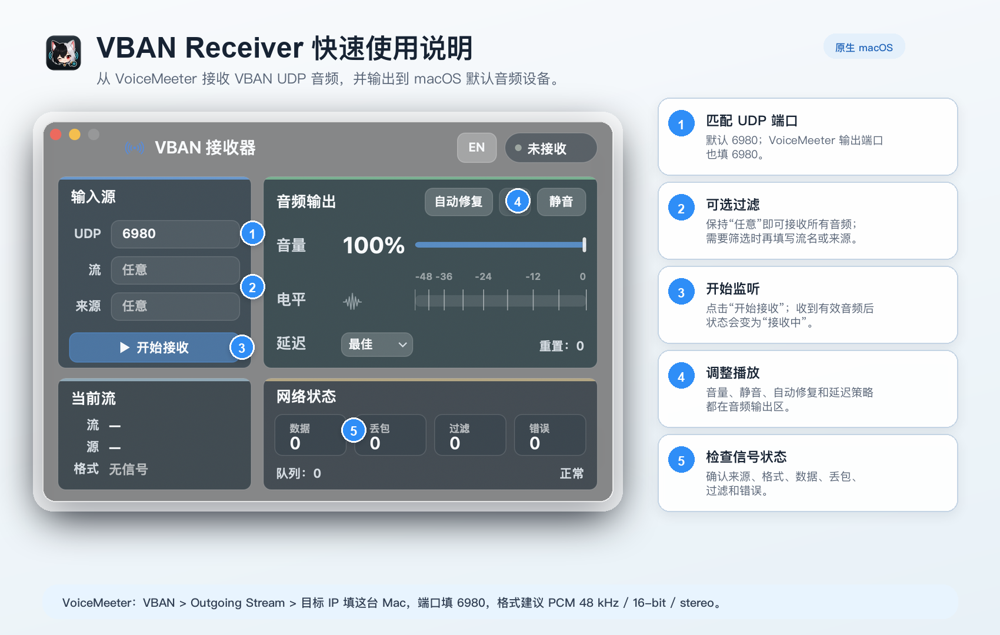

# VBAN Receiver Wiki

<p align="center">
  <a href="wiki.en.md">English Wiki</a>
</p>

这份 Wiki 详细说明 VBAN Receiver 的每个区域、按钮、字段、状态和常见排障路径。



## 工作原理

VBAN Receiver 在 macOS 上监听一个 UDP 端口，解析 VoiceMeeter 发来的 VBAN AUDIO 数据包，把支持的 PCM 采样转换成 CoreAudio 可播放的 32-bit float 音频，并输出到当前默认音频设备。

接收器使用 IPv6 UDP socket，并关闭 `IPV6_V6ONLY`，所以同一个监听 socket 可以接收 IPv6 和 IPv4 映射地址。界面里的 `来源/Source` 过滤按发送端 host 精确匹配，不包含端口。

## 主窗口总览

窗口固定为 `600 x 400`，不能缩放。主要区域如下：

- 顶部栏：应用标题、语言切换、接收状态。
- 输入源：端口、流名、来源过滤、开始/停止接收。
- 当前流：当前收到的流名、发送端、音频格式。
- 音频输出：音量、电平、延迟、静音、自动修复、手动修复、重置次数。
- 网络状态：数据、丢包、过滤、错误、队列和质量状态。

## 顶部栏

### 应用标题

显示 `VBAN Receiver` 或 `VBAN 接收器`。标题旁边是应用图标和无线音频符号。

### 语言按钮

- 英文界面显示 `中`，点击后切换到中文。
- 中文界面显示 `EN`，点击后切换到英文。
- 切换语言不会停止接收，也不会清空统计数据。

### 状态胶囊

状态胶囊位于右上角，包含一个颜色圆点和状态文字：

- `Stopped / 未接收`：没有监听 UDP 端口。
- `Waiting / 等待中`：已经开始监听，但最近 2 秒没有收到有效音频包。
- `Receiving / 接收中`：最近 2 秒内收到有效音频包。

状态颜色随状态变化：停止为灰色，等待为黄色，接收中为绿色。

## 输入源区域

### UDP 端口

默认端口是 `6980`。开始接收时会校验端口范围，必须是 `1-65535`。

如果端口被占用、权限不足或系统无法 bind，界面会在网络状态区域显示错误信息。

### 流 / Stream

用于按 VBAN stream name 过滤。

- 留空：接收任意 VBAN 音频流。
- 填写流名：只接收完全匹配的 stream name。
- 匹配是精确匹配；如果名称不一致，数据会计入 `过滤/Filtered`。

### 来源 / Source

用于按发送端 host 过滤。

- 留空：接收任意发送端。
- 填写 host/IP：只接收完全匹配的发送端 host。
- IPv4 映射地址会显示为普通 IPv4，例如 `192.168.1.20`。
- 不要填写端口；发送端显示区可能会展示 `host:port`，但过滤使用的是 host。

### 开始接收 / Start Receiving

点击后：

- 统计数据清零。
- 端口、流、来源字段锁定，防止运行中修改接收条件。
- 按当前延迟档位配置音频缓冲策略。
- UDP socket 开始监听。
- 按钮变为 `Stop Receiving / 停止接收`。

### 停止接收 / Stop Receiving

运行中同一个按钮会变为停止按钮。点击后：

- 停止 UDP receiver。
- 写入一次诊断快照。
- 重置 CoreAudio 输出队列。
- 清空电平显示。
- 端口、流、来源字段重新可编辑。

### 键盘启动/停止

窗口聚焦时，按 `Return` 或 `Enter` 可以切换开始/停止接收。带 `Command`、`Control` 或 `Option` 的组合键不会触发这个切换。

## 当前流区域

### 流 / Stream

显示当前收到的 VBAN stream name。若数据包没有流名，则显示 `(unnamed) / （未命名）`。

### 源 / Source

显示当前收到数据包的发送端，通常是 `IP:port`。

### 格式 / Format

显示当前音频格式，例如采样率、位深和声道数。未收到信号时显示 `No signal / 无信号`。

格式文字会压缩显示，例如 `48000 Hz` 会被压成 `48k`，避免小窗口内溢出。

## 音频输出区域

### 音量 / Volume

显示当前输出音量百分比，范围 `0%-100%`。

可操作方式：

- 鼠标点击或拖动音量条。
- 音量条获得焦点后，方向键调整音量。
- 普通方向键步进约 `5%`。
- 按住 `Shift` 后方向键步进约 `1%`.
- `Home` 设为 `0%`，`End` 设为 `100%`。

音量只影响本 app 输出，不改变系统音量。

### 电平 / Level

电平表显示输入音频和实际输出音量后的电平，刻度为 `-48 dB` 到 `0 dB`。

- 有输入但音量低时，输入电平可能高于输出电平。
- 静音时输出电平按 0 处理。
- 电平显示会做平滑处理，避免视觉跳动。

### 延迟 / Latency

延迟菜单控制播放缓冲策略。越快的档位越低延迟，但更容易在 Wi-Fi 抖动时断续；越慢的档位缓冲更深，更稳定。

| 档位 | 最大排队时长 | 最大缓冲数 | 起播缓冲数 | 适用场景 |
|---|---:|---:|---:|---|
| `Fast / 快速` | 0.30 秒 | 192 | 2 | 最低延迟，适合稳定有线局域网 |
| `Optimal / 最佳` | 0.60 秒 | 384 | 2 | 默认策略，延迟和稳定性均衡 |
| `Medium / 中等` | 0.90 秒 | 512 | 2 | 普通 Wi-Fi 或轻微抖动 |
| `Slow / 慢速` | 1.80 秒 | 1024 | 4 | Wi-Fi 不稳定或发送端偶发突发 |
| `Very Slow / 非常慢` | 3.00 秒 | 2048 | 6 | 优先稳定播放，允许较高延迟 |

切换延迟档位会写入诊断快照，不会自动停止 UDP 接收。

### 自动修复 / Auto

自动修复默认关闭。开启后，如果检测到输出队列看起来卡住、CoreAudio 输出状态异常或输出设备变更，app 会尝试自动重连输出队列。

适合以下情况：

- 蓝牙耳机或外接声卡切换后没有声音。
- 系统默认输出设备改变。
- 音频队列显示运行但实际没有正常消耗。

### 手动修复 / Sparkle 按钮

按钮显示为 `✨`。运行中点击会：

- 锁定当前默认输出设备策略。
- 重连 CoreAudio 输出。
- 重置音频输出和缓冲队列。
- 写入诊断快照。
- 增加 `Reset / 重置` 计数。

这个按钮适合“能收到数据但没声音”的恢复场景。

### 静音 / Mute

静音只影响 app 输出，不停止接收，不清空缓冲，也不改变系统音量。

静音开启后：

- 输出音量传给 CoreAudio 为 `0`。
- 音量百分比仍保留原来的滑块值。
- 取消静音后恢复原来的输出音量。

### Reset / 重置

显示输出队列被重置的次数，包括：

- 手动修复。
- 队列压力过高时主动丢弃/重置缓冲。
- 输出队列异常恢复。

如果这个数字持续增加，通常说明网络抖动、发送端突发、输出设备变化或当前延迟档位过低。

## 网络状态区域

### 数据 / Data

收到并成功解析、且没有被过滤的 VBAN AUDIO 数据包数量。

### 丢包 / Missing

根据 VBAN frame counter 推算缺失包数。

如果收到的 frame counter 跳过了预期值，会增加缺失计数。缺口异常大时会按 1 次异常计入，避免错误数据导致计数爆炸。

### 过滤 / Filtered

因为 `流/Stream` 或 `来源/Source` 过滤条件不匹配而被丢弃的数据包数量。

如果 `Filtered` 增长但 `Data` 不增长，优先检查：

- VoiceMeeter stream name 是否和 app 填写完全一致。
- `Source` 是否只填 host/IP，没有填端口。
- 发送端 IP 是否发生变化。

### 错误 / Errors

无效 VBAN 包、UDP 接收错误、解析错误会计入错误数量，并显示错误消息。

常见错误包括：

- 端口无法绑定。
- 数据不是有效 VBAN 包。
- 音频格式无法解码。
- CoreAudio 无法创建或写入输出队列。

### Queue / 队列

底部队列文字用于显示队列状态。当前界面主显示为 `Queue: 0 / 队列：0`，输出队列重置次数显示在音频输出区域的 `Reset / 重置`。

### Normal / Check

网络质量摘要：

- `Normal / 正常`：没有丢包和错误。
- `Check / 需留意`：出现丢包或错误。

## 菜单项

### About VBAN Receiver

显示版本号、构建号和作者信息。

### Write Diagnostic Snapshot

向诊断日志写入当前音频输出、队列、设备和状态快照。

### Open Diagnostic Log

打开诊断日志所在位置。日志路径为：

```text
~/Library/Logs/VBAN Receiver/diagnostics.jsonl
```

日志采用 JSON Lines，每一行是一个事件或快照。

### Repair Output

菜单里的 `Repair Output` 等同于界面上的 `✨` 手动修复按钮。快捷键是 `Command + R`。

### Dock 菜单

Dock 图标菜单提供：

- `Start Receiving / Stop Receiving`
- `Repair Output`

## 支持的音频

支持 VBAN AUDIO over UDP，并支持以下 PCM 数据类型：

- unsigned 8-bit
- signed 16-bit
- signed 24-bit
- signed 32-bit
- 32-bit float
- 64-bit float

内部会转换成 CoreAudio 输出使用的 32-bit float。采样率和声道数从 VBAN 数据包读取；当格式变化时，输出队列会重建。

不支持的内容：

- 压缩 VBAN codec。
- VBAN serial/text 等非音频子协议。

## 常见场景

### 没有声音

1. 确认状态是否是 `Receiving / 接收中`。
2. 确认 `Data` 是否增长。
3. 确认 macOS 默认输出设备正确。
4. 确认没有开启 `Mute / 静音`。
5. 点击 `✨` 手动修复输出。
6. 如果经常复现，开启 `Auto / 自动修复`。

### 一直 Waiting / 等待中

1. 确认 VoiceMeeter 已启用 outgoing stream。
2. 确认目标 IP 是这台 Mac 的局域网 IP。
3. 确认端口和 app 一致，默认 `6980`。
4. 临时清空 `Stream` 和 `Source` 过滤条件。
5. 检查防火墙是否拦截 UDP。

### Filtered 持续增长

说明 app 收到了 UDP/VBAN 数据，但过滤条件不匹配。

处理方式：

- 清空 `Stream` 测试是否恢复。
- 清空 `Source` 测试是否恢复。
- 对照当前流区域显示的来源 host，再填写过滤条件。

### Missing 持续增长

说明 frame counter 有缺口，通常是网络丢包或发送端突发。

处理方式：

- 优先使用有线网络。
- 将延迟档位调到 `Medium`、`Slow` 或 `Very Slow`。
- 降低发送端音频负载或避免 Wi-Fi 漫游。

### Errors 增长

说明收到无效数据、格式异常或 CoreAudio 出错。

处理方式：

- 确认 VoiceMeeter 输出的是 PCM VBAN AUDIO。
- 避免把 serial/text VBAN 流发到同一端口。
- 打开诊断日志查看最近错误事件。

## 发布说明

`make app` 生成的 app bundle 使用 ad-hoc 签名，适合本机测试。若要给其他人下载运行，需要 Developer ID 签名和 notarization。
